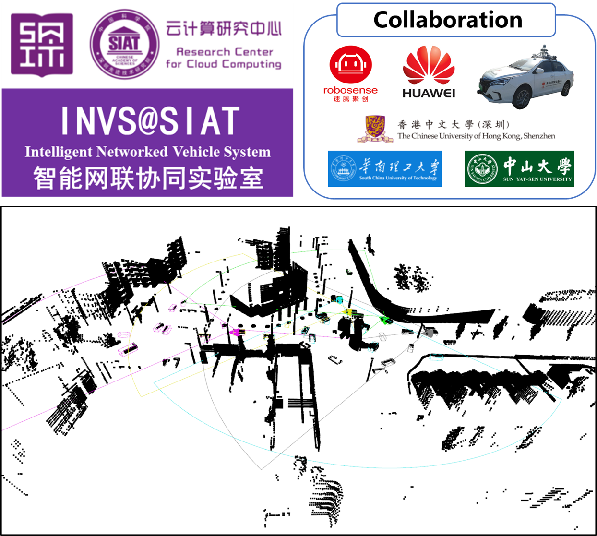

# Intelligent Networed Vehicle System (INVS)

We are Intelligent Networked Vehicle System Lab from Shenzhen Institute of Advanced Technology, Chinese Academy of Sciences.
Our long-term goal is to realize trust-worthy interactive autonomous systems.
Currently, we work on connected autonomous vehicles and edge robotics systems.
We leverage optimization, maching learning, and simulation tools to advance their efficiency and robustness.

